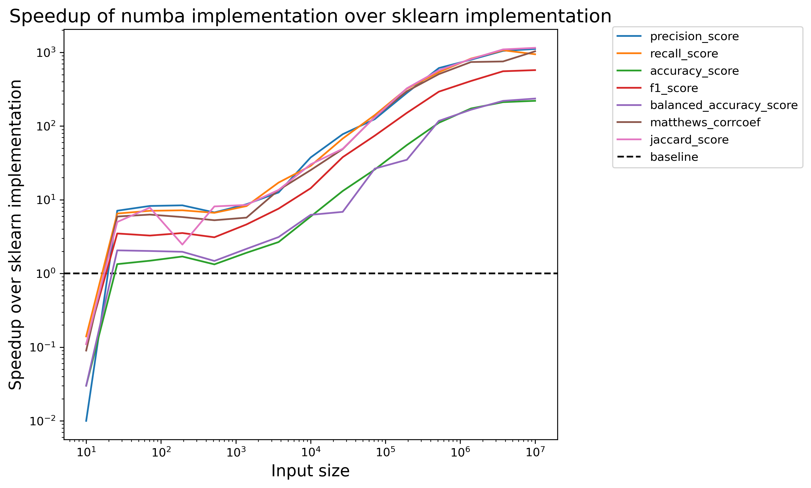

[](https://www.gnu.org/licenses/agpl-3.0)


# fast_confusion_matrix

This project provides a set of functions to calculate various metrics for **binary** classification tasks using a fast confusion matrix calculation method. The metrics calculated include precision, recall, specificity, accuracy, F1 score, balanced accuracy, Matthews correlation coefficient, and Jaccard score.

## Benchmarking results

The speedups are calculated on a Apple M1 Pro as the mean over 15 runs each. You can check the speedups on your machine by simply running `benchmarking.py`. 



## Requirements
- Numpy
- Numba

## Installation

To install the project locally using pip from the `pyproject.toml` file, you can use the following steps:

1. First, clone this repository

```bash
git clone git@github.com:mbruhns/fast_confusion_matrix.git
```

2. Next, navigate to the project directory:

```bash
cd fast_confusion_matrix
```

3. Then, install the project using pip. The `-e` flag is for editable mode, which means changes to the source code will be immediately effective without the need for reinstallation. The `.` specifies the current directory (which should be the project root):

```bash
pip install -e .
```

This command tells pip to find the `pyproject.toml` file in the current directory and install the project according to the configurations specified in the file.

Please note that you might need to use `pip3` instead of `pip` depending on your Python installation. Also, it's recommended to use a virtual environment to avoid conflicts with other projects.

## Usage

Import the required functions from the `metrics.py` file:

```python
from fast_confusion_matrix.metrics import precision_score
```

You can then use these functions in your code. For example, to calculate the precision score:

```python
y_true = [1, 0, 1, 1, 0, 1]
y_pred = [1, 0, 0, 1, 0, 1]
precision = precision_score(y_true, y_pred)
print(f"Precision: {precision}")
```

## Functions

- `calculate_confusion_matrix(labels, predictions)`
- `precision_score(y_true, y_pred)`
- `recall_score(y_true, y_pred)`
- `accuracy_score(y_true, y_pred)`
- `f1_score(y_true, y_pred)`
- `balanced_accuracy_score(y_true, y_pred)`
- `matthews_corrcoef(y_true, y_pred)`
- `jaccard_score(y_true, y_pred)`